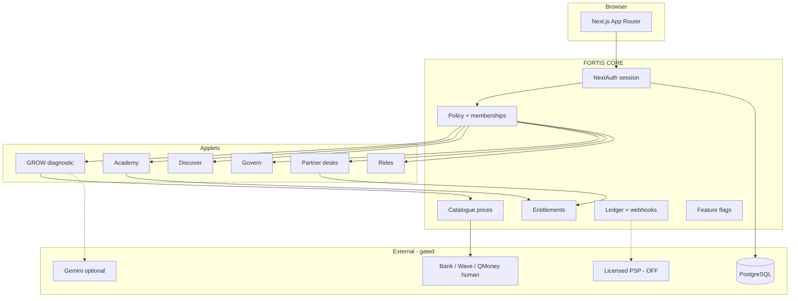

# Agency architecture package — FORTIS-SBN

**Orchestrator date:** 24 August 2026  
**Project:** FORTIS OS / FORTIS-SBN  
**Stack (fixed):** Next.js 14, NextAuth, Prisma/PostgreSQL, transfer rail, optional Gemini BYOK, Google/OSS first.  
**Audience:** Gambian SMEs, learners, partner applicants, citizens (GOVERN intake).  
**Primary goal:** Honest pilot — GROW + Academy + empty Partner desks. **Not** public commerce.

**Restated brief:** Build a Gambia-priced operating network that sells verifiable diagnostics and skills, not fake inventory. Live card capture, licensed escrow, and NAQAA tickets stay off until external sign-off.

**Reality Checker — public Gambia commerce:** **FAIL / NEEDS MORE WORK.**  
**Reality Checker — continue honest pilot:** **PASS** (no critical invented-money paths remaining on the three service desks).

---

## 1. Director’s intent

The system is a **control plane (CORE)** plus applets. Quality bar: fail closed, tenant from session only, no mock FX/weather/certs, no self-serve CEO. Every major decision exists to survive a GBoS/CBG/NAQAA/CBG-adjacent journalist, not a YC demo day.

## 2. Module A — architecture & specification

### System context (Mermaid)



### Boundaries

- **In:** HTML/JSON over HTTPS, transfer instructions, HMAC credentials, consented enquiries.
- **Out:** No card PAN, no e-money, no auto court orders, no live marketplace SKUs.

### Entities (already in Prisma Core)

Organisation, User, Membership, CataloguePrice, Entitlement, TransferInstruction, LedgerEntry, AuditEvent, Credential, Complaint, Listing (verified-only public), MerchantKyb.

### Indexing / retention (policy)

- Transfer `reference` unique. Audit append-only. Credentials keyed by serial.  
- Evidence: retain only after malware product exists. GROW inputs: 90 days unless entitled export.  
- Enquiries: consent required; no “booked” state.

### API protocols

Auth: NextAuth session cookie (not OAuth2 resource-server JWT yet).  
Core: `GET /api/v2/status`, `GET /api/v2/modules`, `GET /api/v2/catalogue`, `POST /api/v2/transfers`, `POST /api/v2/transfers/evidence`, `POST /api/v2/services/enquiries`, Academy/GROW/GOVERN as documented.

OpenAPI: not generated this pass — contract is the route handlers + tests. Do not invent a GraphQL layer.

### AI engine blueprint

Waterfall: deterministic → optional Gemini narrative → never silent paid API. No vector store in production. No embeddings product until Transformers.js is explicitly approved. RAG is **cited public JSON** (`data/published/`), not a hallucinated index.

## 3. Context library seed

### ADRs

1. **Transfer before PSP** — GMD 250/150/350 catalogue; live flag default false.  
2. **Empty inventory is a feature** — Partner commerce closed.  
3. **HMAC not blockchain** for Academy.  
4. **Session tenant only** — no client org spoof.  
5. **Google/OSS first** — no required OpenAI.

### Agent prompt template

`Role: [name]. Stack: Next 14 + Prisma. Do not enable module.core.payments.live. Do not invent listings. Tests in tests/core. Commit only arena/01a02ef3-fortis-saas.`

## 4. Decomposition (parallel workstreams)

| Package | Goal | Verify |
|---|---|---|
| P1 Legal copy | Privacy/terms match rails | grep OpenAI/Stripe = 0 |
| P2 Demo | Honest walkthrough | `/demo` lists real URLs |
| P3 Status | Gemini not OpenAI | `/api/v2/status` |
| P4 IaC sample | Dockerfile for ops | builds Node 20 |
| P5 Docs | This file + launch | Reality FAIL commerce |
| P6 PSP (external) | Licensed checkout | **blocked** |
| P7 KYB staff | Human reviewers | **blocked** |
| P8 Workflows | CI on GitHub | copy `docs/phase-0/quality-workflow.yml` |

## 5. Orchestration DAG

```text
P1,P2,P3,P4,P5  →  Reality Checker  →  (stop before P6/P7)
Admin copies workflow (human)  →  Module C partial
```

Merge rule: never take remote “demo products” over empty inventory.

## 6. Verification protocol

- Unit: vitest `tests/core` (56+).  
- Never ship without: live payments false; empty public marketplace GET; enquiry `booked:false`; HMAC verify fail-closed.  
- Human gates: PAYMENT_LIVE_DECISION signatures.

## 7. Risk register

| Risk | Mitigation |
|---|---|
| Agents re-add DEMO_PRODUCTS | production-blocks + tests |
| Prisma CDN fail | PGlite validate |
| Workflow permission | copy YAML |
| LLM cost | Gemini off by default |
| Public trust | empty shelves |

## 8. First execution commands

```bash
npx vitest@2.1.9 run tests/core
# admin: copy docs/phase-0/quality-workflow.yml → .github/workflows/quality.yml
# do NOT set FORTIS_FLAG_MODULE_CORE_PAYMENTS_LIVE=true
```

## Module C/D (ops, not live money)

- Health: `GET /api/v2/status`  
- Incident Sev: see `docs/runbooks/incident.md`  
- Backups: `docs/runbooks/backups.md`  
- Events (no Mixpanel installed): `enquiry_received`, `transfer_instruction_created`, `grow_preview_run`, `academy_paper_submitted` — log via audit, do not fake pixels.

## Growth (honest)

Funnel: `/` → `/onboarding` → `/grow/workspace` → `/pay/transfer`. No fake enrolments. No viral “booked in 4 hours”.

## Whimsy

Empty states tell the truth: “0 machines. That is correct.”

---

## Verdict — real public deployment in The Gambia

| Use | Deploy? |
|---|---|
| Public learn + GROW preview + transfer *instructions* | Yes, as **pilot**, with operator account env set |
| Public “book a lawyer / hire a crane / DHL tracking” | **No** |
| Public card checkout / marketplace GMV | **No** until PSP + legal + KYB staff |
| Government endorsement claim | **No** |

**Reality Checker will not open Module C for commerce.**
